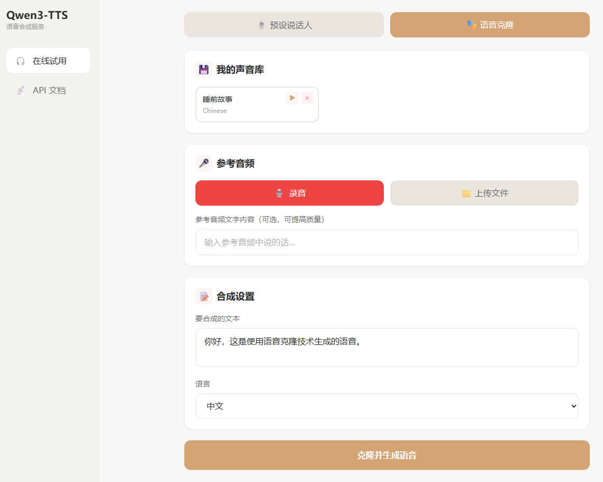

# Qwen3-TTS 语音合成服务

[English](README_EN.md)

基于阿里巴巴 Qwen3-TTS 模型的语音合成 Web 应用，支持预设说话人和语音克隆功能。



> **注意**: 由于官方 SDK 暂未开放流式输出接口，本项目暂不支持流式语音输出。

---

## 功能特性

- **预设说话人**: 9 种内置声音，支持情感控制
- **语音克隆**: 3秒以上参考音频即可克隆声音
- **声音库**: 保存和管理克隆的声音，方便重复使用
- **多语言**: 支持10种语言
- **网页界面**: 支持浏览器录音的网页界面
- **REST API**: 便于集成到您的应用

## 支持的语言

中文、英语、日语、韩语、德语、法语、俄语、葡萄牙语、西班牙语、意大利语

## 预设说话人

| 说话人 | 语言 | 性别 |
|--------|------|------|
| vivian | 中文 | 女 |
| uncle_fu | 中文 | 男 |
| aiden | 英语 | 男 |
| serena | 英语 | 女 |
| ono_anna | 日语 | 女 |
| sohee | 韩语 | 女 |
| dylan | - | 男 |
| eric | - | 男 |
| ryan | - | 男 |

---

## 安装

### 环境要求

- Python 3.8+
- 支持 CUDA 的 GPU（建议8GB以上显存），或 macOS Apple Silicon (M1/M2/M3)
- 支持 CUDA 或 MPS 的 PyTorch

> **macOS 用户注意**: Apple Silicon 芯片通过 MPS 后端支持，会自动检测并使用 float16 精度。实际兼容性取决于 qwen-tts 库对 MPS 的支持情况。

### 安装依赖

```bash
pip install -U qwen-tts fastapi uvicorn python-multipart soundfile numpy torch
```

### 下载模型

```bash
pip install -U modelscope

# CustomVoice 模型（预设说话人）
modelscope download --model Qwen/Qwen3-TTS-1.7B-CustomVoice --local_dir ./models/Qwen3-TTS-1.7B-CustomVoice

# VoiceDesign 模型（声音设计）
modelscope download --model Qwen/Qwen3-TTS-1.7B-VoiceDesign --local_dir ./models/Qwen3-TTS-1.7B-VoiceDesign

# Base 模型（语音克隆）
modelscope download --model Qwen/Qwen3-TTS-0.6B --local_dir ./models/Qwen3-TTS-0.6B
```

---

## 使用方法

### 启动服务

```bash
python api_server.py
```

服务运行在 http://localhost:8000

### 网页界面

在浏览器中打开 http://localhost:8000 即可使用网页界面。

---

## 性能优化

### Flash Attention（推荐）

安装 Flash Attention 可提升推理速度约 **50%**。

**Linux:**
```bash
pip install flash-attn --no-build-isolation
```

**Windows:**

Windows 不支持源码编译，需使用预编译包。从 [kingbri1/flash-attention](https://github.com/kingbri1/flash-attention/releases) 下载对应版本的 wheel 文件。

示例（Python 3.10 + PyTorch 2.9 + CUDA 12.8）：
```bash
# 先升级 PyTorch
pip install torch==2.9.0 torchaudio --index-url https://download.pytorch.org/whl/cu128

# 安装预编译的 flash-attn
pip install https://github.com/kingbri1/flash-attention/releases/download/v2.8.3/flash_attn-2.8.3+cu128torch2.9.0cxx11abiFALSE-cp310-cp310-win_amd64.whl
```

验证安装：启动服务后不再显示 `Warning: flash-attn is not installed`

### 进一步优化

如需达到更高性能（如官方宣称的 97ms/字），需要：

| 方案 | 预期提升 | 说明 |
|------|----------|------|
| 更强 GPU | 2-5x | A100/H100 vs 消费级显卡 |
| vLLM 部署 | 2-3x | PagedAttention + 连续批处理 |
| TensorRT-LLM | 2-5x | NVIDIA 官方推理优化 |
| FP8 量化 | 1.5-2x | 需 H100 支持 |

> 消费级显卡（RTX 40系）+ Flash Attention 达到 ~1.4s/字 是合理水平。

---

## API 文档

### 预设说话人合成

```bash
# GET 请求
curl "http://localhost:8000/tts?text=你好&speaker=vivian&language=Chinese" -o output.wav

# 带情感指令
curl "http://localhost:8000/tts?text=你好&speaker=vivian&language=Chinese&instruct=用开心的语气说" -o output.wav
```

**参数:**
| 参数 | 说明 | 默认值 |
|------|------|--------|
| text | 要合成的文本 | 必填 |
| speaker | 说话人 | vivian |
| language | 语言 | Chinese |
| instruct | 情感指令 | 可选 |

### 语音克隆

```bash
curl -X POST "http://localhost:8000/clone" \
  -F "audio=@reference.wav" \
  -F "text=你好世界" \
  -F "language=Chinese" \
  -F "ref_text=参考音频的文字内容" \
  -o output.wav
```

**参数:**
| 参数 | 说明 |
|------|------|
| audio | 参考音频文件（3-10秒） |
| text | 要合成的文本 |
| language | 语言 |
| ref_text | 参考音频文字内容（可选，提高质量） |

### 声音库管理

```bash
# 获取已保存的声音
curl http://localhost:8000/voices

# 保存声音
curl -X POST "http://localhost:8000/voices/save" \
  -F "name=我的声音" \
  -F "language=Chinese" \
  -F "audio=@reference.wav"

# 使用已保存的声音
curl -X POST "http://localhost:8000/voices/{voice_id}/tts" \
  -F "text=你好世界" \
  -o output.wav

# 删除声音
curl -X DELETE "http://localhost:8000/voices/{voice_id}"
```

### 其他接口

```bash
# 获取可用说话人
curl http://localhost:8000/speakers

# 获取支持的语言
curl http://localhost:8000/languages
```

---

## 项目结构

```
├── api_server.py      # FastAPI 服务端
├── index.html         # 网页界面
├── test_qwen_tts.py   # 测试脚本
├── models/            # 模型文件（不在仓库中）
└── saved_voices/      # 保存的克隆声音
```

---

## 许可证

本项目使用 Qwen3-TTS 模型，模型许可证请参考 [Qwen3-TTS](https://github.com/QwenLM/Qwen3-TTS)。
